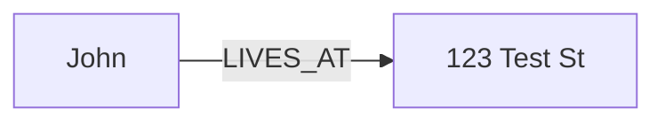
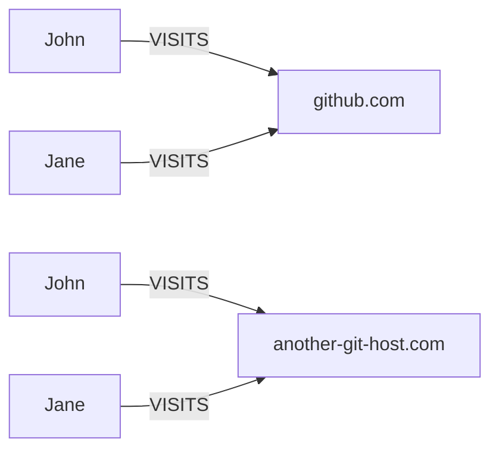

# Interpreter

The interpreter takes instructions on how to convert a document or record like our JSON data and map it into nodes and relationships 
that we want to be in our graph. In order to do this, we provided the interpreter with a set of instructions that tell it how to
interpret the data. These instructions are provided in a YAML file that is passed to the interpreter. Each of these intstructions are 
referred to as an interpretation which you can view the reference of [here](./interpretations.md)

## Basics

Imagine records that look like this:

```json
{"name": "John", "address": "123 Test St"},
{"name": "Jane", "address": "456 Test St"}
```
And we want to map the records into nodes and relationships that look like this:




then we can use the following YAML definition to instruct the interpreter on how to do this:

```yaml
- implementation: nodestream.interpreting:Interpreter
  arguments:
    interpretations:
      - type: source_node
        name: !jmespath name
        node_type: AwesomePerson
      - type: relationship
        related_node_type: Address
        related_field_name: address
        relationship_type: LIVES_AT
        search: !jmespath address
```


## Using `iterate_on` and `before_iteration`

Sometimes single records come in a format were multiple ingestions are required for that single record. In cases where the record contains a single list, you can use a combination of the `iterate_on` and `before_iteration` keywords. `iterate_on` is given a `ValueProvider` for extrcting the subrecords of the source recod. While `before_iteration` is a separate section of interpretations applied to all objects matched by iterate_on. For example, take the following object:

```json
{
  "team_name": "Nodestream",
  "people": [
    {"name": "John", "address": "123 Test St"},
    {"name": "Jane", "address": "456 Test St"}
  ]
}
```

We can use `iterate_on` to iterate over the `people` list and `before_iteration` to set the `team_name` for each person.

```yaml
- implementation: nodestream.interpreting:Interpreter
    arguments:
      before_iteration:
        - type: relationship
          related_node_type: AwesomeTeam
          related_field_name: name
          relationship_type: PART_OF
          search: !jmespath team_name
      iterate_on: !jmespath people[*]
      interpretations:
        - type: source_node
          name: !jmespath name
          node_type: AwesomePerson'
        - type: relationship
          related_node_type: Address
          related_field_name: address
          relationship_type: LIVES_AT
          search: !jmespath address
```

Note that in the `interpretations` section we are using `!jmespath` that are relative to the current object in the iteration. In the `before_iteration` section we are using `!jmespath` that are relative to the source object.

## Performing Multiple Passes

One limitation is that the interpreter can only relate nodes one level deep. For example, if we want to relate a person to a team, and a team to an address,  and an address to a city, we can't do that in a single pass. To accomplish it, we can do this by performing multiple passes over the data. In the following example, we will perform two passes. The first pass will relate a person to a team, and the second pass will relate a team to an address.

Imaging we have data like this:

```json
{"name": "John", "address": "123 Test St", "city": "Test City"},
{"name": "Jane", "address": "456 Test St", "city": "Test City"}
```
We can use the following YAML definition to instruct the interpreter on how to parse this data:

```yaml
- implementation: nodestream.interpreting:Interpreter
  arguments:
    interpretations:
      - - type: source_node
          name: !jmespath name
          node_type: AwesomePerson
        - type: relationship
          related_node_type: Address
          related_field_name: address
          relationship_type: LIVES_AT
          search: !jmespath address
      - - type: source_node
          name: !jmespath address
          node_type: Address
        - type: relationship
          related_node_type: City
          related_field_name: city
          relationship_type: IN_CITY
          search: !jmespath city
```


Mutliple interpretation passes are also allowed for the `before_iteration` block. 
In this case, the `iterate_on` and `iterpretation` blocks are applied on the result of each pass pass of the `before_iteration` block.

For example, imagine we have data like this:

```json
{
  "site": "github.com",
  "other_site": "another-git-host.com",
  "people": [
    {"name": "John", "address": "123 Test St"},
    {"name": "Jane", "address": "456 Test St"}
  ]
}
```

We can use the following YAML definition to instruct the interpreter on how to parse this data:

```yaml
- implementation: nodestream.interpreting:Interpreter
  arguments:
    before_iteration:
      - - type: variables
          site: !jmespath site
      - - type: variables
          site: !jmespath other_site
    iterate_on: !jmespath people[*]
    interpretations:
      - type: source_node
        name: !jmespath name
        node_type: AwesomePerson
      - type: relationship
        node_type: Website
        relationship_type: VISITS
        node_key:
          site: !variable site
```

This would result in the following graph:


