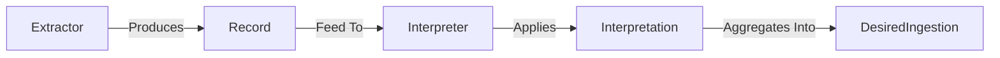
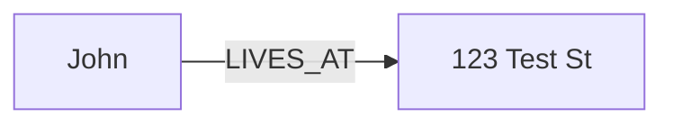
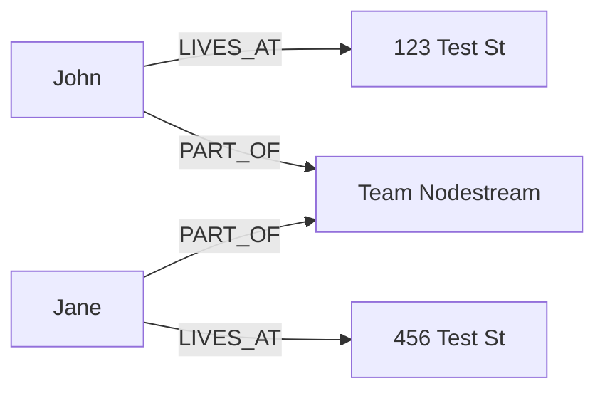
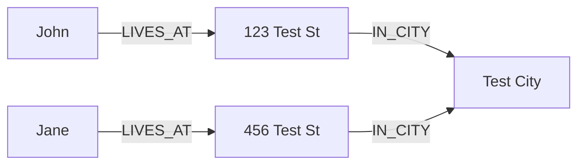
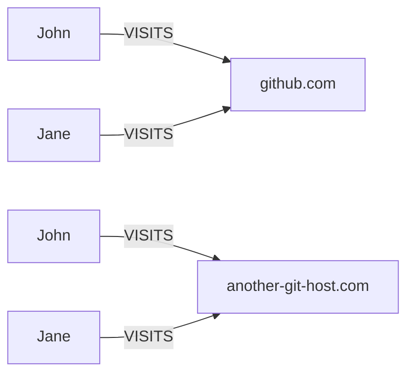

# Interpreter

## Interpreters vs Interpretations 

An `Interpretation` is essentially an instruction on how to extract information from an individual record. 
When combined with other interpretations via an interpreter, we are able to declaratively describe how records are represented as a graph.

Conceptually, this can be modeled like so:



In the above diagram, we can see that an `Extractor` produces a `Record` which is then fed to an `Interpreter`. 
The `Interpreter` then applies `Interpretation`s to the `Record` and aggregates the result into a `DesiredIngestion`.
The `DesiredIngestion` is the intermediate data model that is used to write data to the database. 
The `DesiredIngestion` is then fed to the `GraphDatabaseWriter` which writes the data to the database.

The [Interpretations Reference](./interpretations.md) goes into depth on each instruction that can be applied to a record.
This reference goes into depth on how to combine interpretations into interpreters.

## Basics

Imagine records that look like this:

```json
{"name": "John", "address": "123 Test St"},
{"name": "Jane", "address": "456 Test St"}
```
And we want to map the records into nodes and relationships that look like this:




then we can use the following YAML definition to instruct the interpreter on how to do this:

```yaml
- implementation: nodestream.interpreting:Interpreter
  arguments:
    interpretations:
      - type: source_node
        node_type: AwesomePerson
        key:
          name: !jmespath name
      - type: relationship
        node_type: Address
        relationship_type: LIVES_AT
        node_key: 
          address:  !jmespath address
```


## Using `iterate_on` and `before_iteration`

Sometimes single records come in a format were multiple ingestions are required for that single record. In cases where the record contains a single list, you can use a combination of the `iterate_on` and `before_iteration` keywords. `iterate_on` is given a `ValueProvider` for extrcting the subrecords of the source recod. While `before_iteration` is a separate section of interpretations applied to all objects matched by iterate_on. For example, take the following object:

```json
{
  "team_name": "Nodestream",
  "people": [
    {"name": "John", "address": "123 Test St"},
    {"name": "Jane", "address": "456 Test St"}
  ]
}
```

Assume as a result, we want a graph that looks like this:



We can use `iterate_on` to iterate over the `people` list and `before_iteration` to set the `team_name` for each person.

```yaml
- implementation: nodestream.interpreting:Interpreter
    arguments:
      before_iteration:
        - type: relationship
          node_type: Team
          relationship_type: PART_OF
          node_ley: 
            name:  !jmespath team_name
      iterate_on: !jmespath people[*]
      interpretations:
        - type: source_node
          key:
            name: !jmespath name
          node_type: AwesomePerson'
        - type: relationship
          node_type: Address
          relationship_type: LIVES_AT
          node_key: 
            address: !jmespath address
```

Note that in the `interpretations` section we are using `!jmespath` that are relative to the current object in the iteration. In the `before_iteration` section we are using `!jmespath` that are relative to the source object.

## Performing Multiple Passes

One limitation is that the interpreter can only relate nodes one level deep. For example, if we want to relate a person to an address, and an address to a city, we can't do that in a single pass. To accomplish it, we can do this by performing multiple passes over the data. In the following example, we will perform two passes. The first pass will relate a person to a team, and the second pass will relate a team to an address.

Imaging we have data like this:

```json
{"name": "John", "address": "123 Test St", "city": "Test City"},
{"name": "Jane", "address": "456 Test St", "city": "Test City"}
```

And as a result, we want a graph that looks like this:



We can use the following YAML definition to instruct the interpreter on how to parse this data:

```yaml
- implementation: nodestream.interpreting:Interpreter
  arguments:
    interpretations:
      - - type: source_node
          node_type: AwesomePerson
          key:
            name: !jmespath name
        - type: relationship
          node_type: Address
          relationship_type: LIVES_AT
          node_key: 
            address: !jmespath address
      - - type: source_node
          key: 
            name: !jmespath address
          node_type: Address
        - type: relationship
          node_type: City
          relationship_type: IN_CITY
          node_key: 
            city: !jmespath city
```


Mutliple interpretation passes are also allowed for the `before_iteration` block. 
In this case, the `iterate_on` and `iterpretation` blocks are applied on the result of each pass pass of the `before_iteration` block.

For example, imagine we have data like this:

```json
{
  "site": "github.com",
  "other_site": "another-git-host.com",
  "people": [
    {"name": "John", "address": "123 Test St"},
    {"name": "Jane", "address": "456 Test St"}
  ]
}
```

We can use the following YAML definition to instruct the interpreter on how to parse this data:

```yaml
- implementation: nodestream.interpreting:Interpreter
  arguments:
    before_iteration:
      - - type: variables
          site: !jmespath site
      - - type: variables
          site: !jmespath other_site
    iterate_on: !jmespath people[*]
    interpretations:
      - type: source_node
        node_type: AwesomePerson
        key:
          name: !jmespath name
      - type: relationship
        node_type: Website
        relationship_type: VISITS
        node_key:
          site: !variable site
```

This would result in the following graph:


