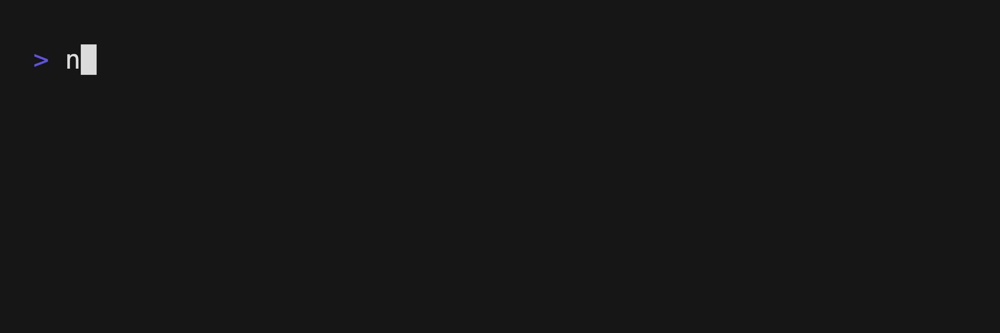

# Nodestream

`nodestream` is a modern and simple framework for performing ETL into Graph Databases.

With `nodestream` you can enjoy:

1. **Building Fast**: with a user friendly and extensible DSL.
2. **Fewer Bugs**: because `less code` == `less bugs`.
3. **Robustness and Resilience**: with battlehardend and optimized components.

[](https://badge.fury.io/py/nodestream)

## Getting Started

Get started with our [Tutorial](./docs/tutorial.md).

## Shell Completion

### BASH - Ubuntu / Debian
```bash
nodestream completions bash | sudo tee /etc/bash_completion.d/nodestream.bash-completion
```

### BASH - Mac OSX (with Homebrew "bash-completion")

```bash
nodestream completions bash > $(brew --prefix)/etc/bash_completion.d/nodestream.bash-completion
```

### ZSH

```zsh
mkdir ~/.zfunc
echo "fpath+=~/.zfunc" >> ~/.zshrc
nodestream completions zsh > ~/.zfunc/_test
```

### FISH

```bash
nodestream completions fish > ~/.config/fish/completions/nodestream.fish
```
